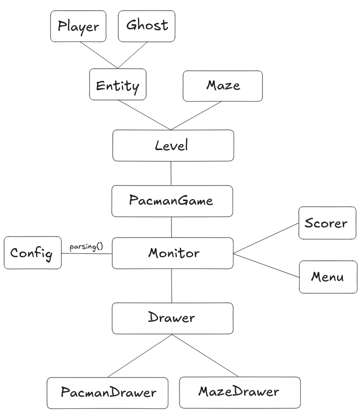

# 13.Pac-Man
draft:
[x] gerer les conflits de deplacement, ajouter inertie automatique avec direction tant que pas de mur
[x] main menu
[x] ajouter les vies
[x] ajouter les pacgums
[x] ajouter les super pacgums
[x] deplacement des fantomes a implementer, random au debut puispathfinding

[x] implent velocity in simulation
[x] generate sequences of coords for movement
[x] stocker les changements de direction queue
[x] pathfinding a implementer
[x] permettre d'inverser et de pouvoir manger les pacgums
[x] crazy mode
[x] animation eating pacman
[ ] bug deplacement pas fluide
[ ] displayer le score et le timer
[ ] demander le nom du joueur en fin de partie
[ ] {'felix': '45000', 'bcondemi': '5012', 'pablo': '10000', 'badge': 'felix'} : highscore can take only alphanumeric
[ ] bug lorsque le dernier pacgum est pris en meme temps que le fait de mourir
[ ] class Color pour les params
[ ] bug new game si jamais le next level n'a plus de level
[ ] comment etablir le timer interne general
[ ] flag : --own_function for draw rectangle
[ ] animation teleportation
[ ] AssetLoader

https://en.wikipedia.org/wiki/Chebyshev_distance
https://en.wikipedia.org/wiki/Taxicab_geometry